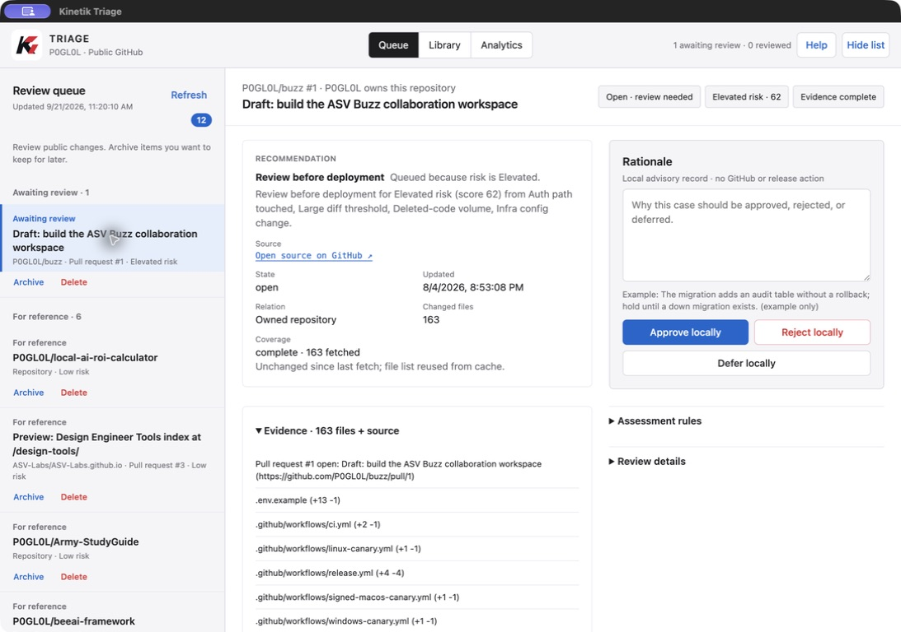
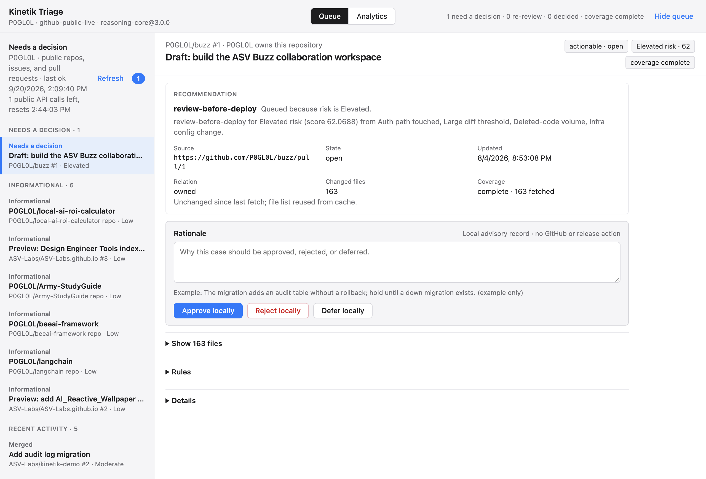
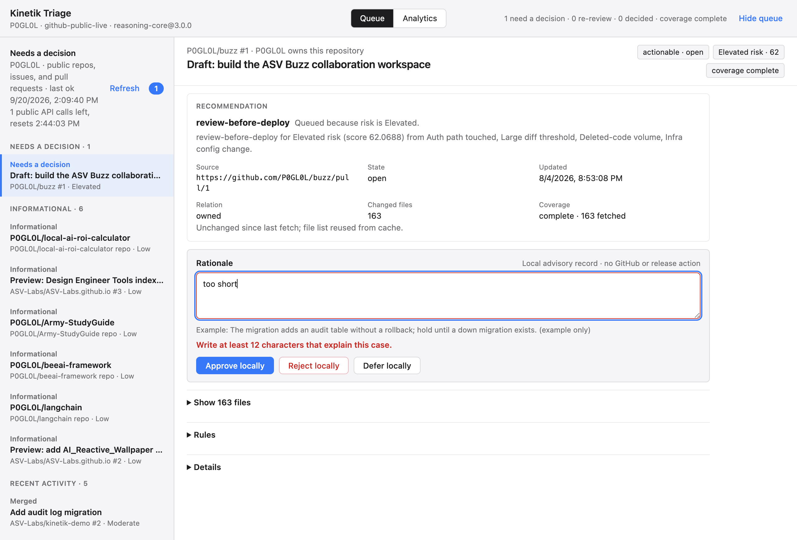
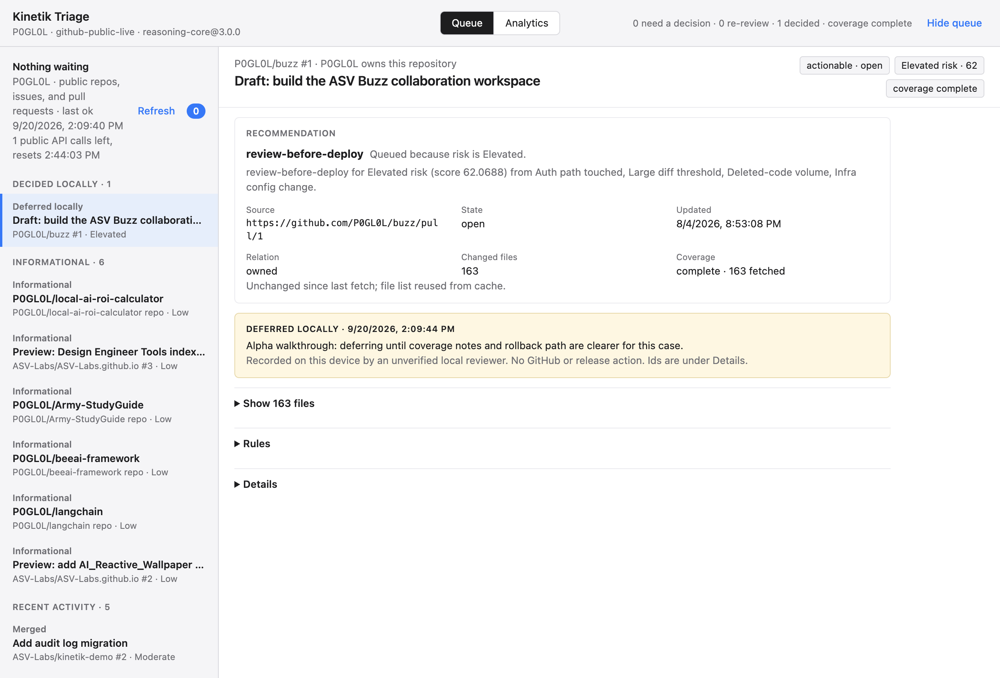
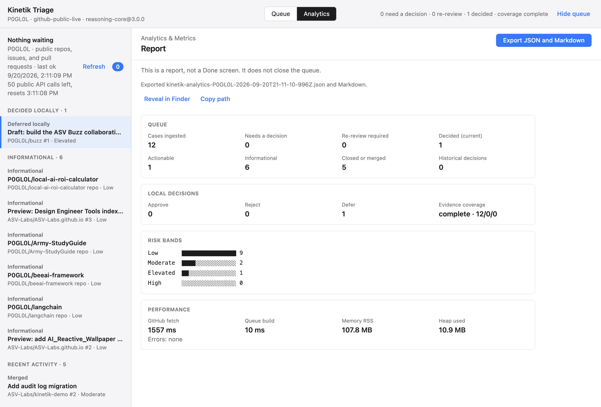
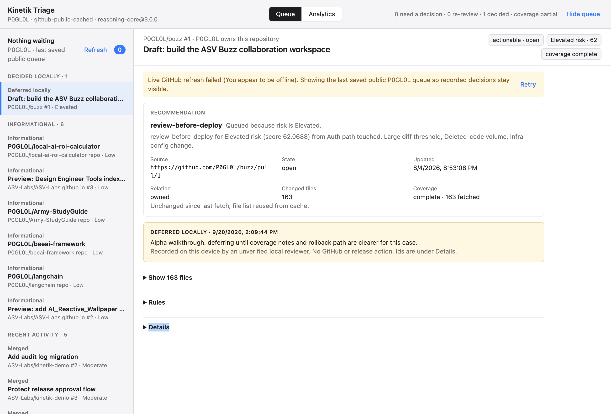
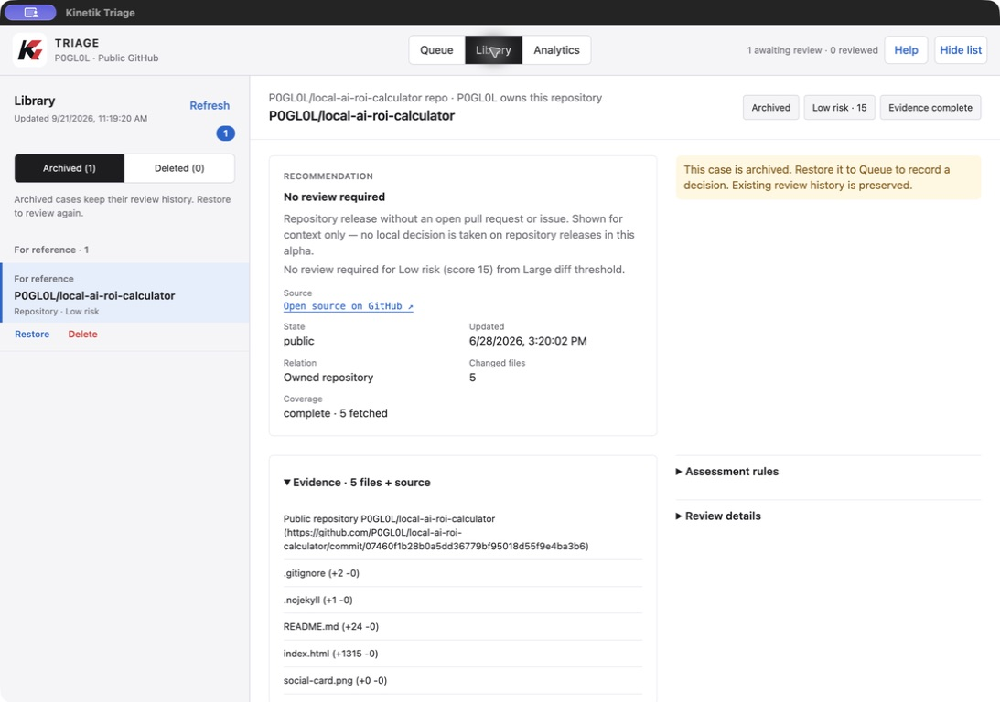

# Kinetik Triage — alpha user guide

**For version 0.9.6 · build 5 · Apple silicon Mac.** Confirm these in **Kinetik Triage → About Kinetik Triage**. About also shows the source revision; the release manifest identifies the exact package.

## What Kinetik does

Kinetik is a desktop app that helps you understand software changes before they affect customers. It gathers public work from GitHub into one review queue, highlights changes that may deserve a closer look, and lets you record what you think should happen next.

This alpha is a **guided public-data pilot**. It reads public activity for **P0GL0L**, including contributions to other repositories. You cannot select your own account yet. Your written decisions stay on your Mac. The app does not merge code, publish releases, deploy software, or write to GitHub.

## Before you install

Use the private package and release notes supplied in your invitation from ASV Labs. They must identify the SHA-256 checksum, version, build, minimum macOS version and notarization status. A checksum verifies a downloaded file matches the listed file; it does not replace macOS security checks.

The 0.9.6/build 5 candidate is Developer ID signed. Tester distribution depends on Apple notarization and final package verification. [Apply by email](https://asv-labs.github.io/kinetik-triage/#alpha) for an invitation; applying is not approval. No public download is offered. Do not use an old sandbox package as a substitute.

You need an Apple silicon Mac running macOS 13 or later and an internet connection for fresh GitHub data. Intel Macs, Windows, and Linux are not supported packages in this alpha. You do not need Node.js, a GitHub account, or a GitHub token to use the packaged app.

## Install and start

1. Download the DMG and matching checksum supplied in your invitation.
2. Open the DMG and drag **Kinetik Triage** to **Applications**.
3. Open **Applications → Kinetik Triage**. If macOS cannot verify the app, stop and [report the problem](https://github.com/ASV-Labs/kinetik-triage/issues). Do not disable Gatekeeper.
4. Open **Kinetik Triage → About Kinetik Triage** and confirm **0.9.6**, build **5**.
5. Click **Help** in the window, or **Help → User Guide** (⌘/), to open this guide beside the app.

If another version is already running, quit it before opening the new one. Opening this app twice focuses the existing review window.

## Your first review

### 1. Find a case

Wait for the public queue to load. Select an item under **Awaiting review**. If that group is empty, the current public activity may have no actionable items. You can still inspect informational and recent activity; there is nothing you must approve just to finish onboarding.

The reading-workspace image above and Library image below were captured from 0.9.6/build 5. The other walkthrough images show the preceding 0.9.4 workflow; they predate the new layout and Library. Use the current button names in these instructions.

| Queue group | Meaning |
| --- | --- |
| Awaiting review | An open change or issue eligible for a local review |
| For reference | Context with no decision requested |
| Completed on GitHub | Closed or merged items, shown as history |
| Reviewed | A decision saved for the current assessment |
| Updated since review | The item or recommendation changed since your decision |

### 2. Read the evidence

Read the recommendation, risk band, coverage, and reason for the recommendation. **Risk is a rule-based review signal, not proof that a change is safe or unsafe.** Coverage says how much of the file list was available. Partial or unavailable coverage means information is missing.

Select the **Source** link to inspect the public item on GitHub in your browser. Open **Evidence**, **Assessment rules**, and **Review details** for supporting context. Repository rows provide background; they do not offer a decision form.

### 3. Write your reason and decide

Write a case-specific reason in **Rationale**, using at least 12 characters. Empty text, very short text, and the supplied example are rejected.

- **Approve locally:** record that you support the proposed action.
- **Reject locally:** record that you do not support it.
- **Defer locally:** record that you need more information or want to revisit it.

All three save a note only on this Mac. They are not GitHub approvals or instructions to a deployment system. Defer does not create a reminder.

### 4. Confirm it saved

A panel shows the recorded outcome and your reason. The case moves to **Reviewed**. Quit and reopen the app to return to your saved review state.

There is no general edit/undo flow in this alpha. Check the reason before submitting. If the underlying assessment changes, your earlier decision is kept as history and a new review may be requested. Closed or informational items retain history without offering an inappropriate new approval.

### 5. Export a report

Open **Analytics** and click **Export JSON and Markdown**. JSON is for tools; Markdown is readable text. Both describe the same report, including case counts, local outcomes, risk bands, coverage, timings, memory, and errors.

Use **Reveal in Finder** to locate the files or **Copy path** to copy their location. Exports have timestamped names such as `kinetik-analytics-P0GL0L-2026-09-21T….json` and `.md` in:

`~/Library/Application Support/Kinetik Triage/analytics/`

Review the contents before sharing. A report may reveal your local review activity, public repository names, timing information, or error details. Exporting does not upload anything.

## Refresh and failures

**Refresh** (⌘R) checks GitHub again. **Retry** appears with an explanation when a load fails. The app may show the last saved queue, clearly labeled, or an empty queue when no saved data exists. Cached data can be out of date.

GitHub limits unauthenticated API requests by public IP address. The app shows the remaining allowance and reset time when available. Other software on your network can share the allowance. Wait until reset rather than repeatedly retrying a rate-limit failure. The app caches responses to reduce requests.

## Keyboard and window controls

| Action | Shortcut or control |
| --- | --- |
| User guide | ⌘/ or Help |
| Refresh | ⌘R |
| Export analytics | ⌘E |
| Next / previous case | ⌘↓ / ⌘↑ |
| Show / hide list | ⌘\\ or Hide list |
| Zoom text | View → Zoom In / Zoom Out |
| Quit | ⌘Q |

Use Tab to move between controls and Return or Space to activate buttons. The window can be resized; Hide list gives the selected case more room.

## Privacy and local files

Kinetik requests public GitHub data. GitHub receives ordinary network metadata, including your public IP address, requested endpoints, and request headers. Kinetik does not send your rationale or local decisions to GitHub and does not request a GitHub token. See the [privacy notice](https://github.com/ASV-Labs/kinetik-triage/blob/main/PRIVACY.md).

| File | Purpose |
| --- | --- |
| `triage-session.json` | Decisions and selected case |
| `corpus-cache.json` | Last public queue and HTTP cache |
| `analytics/` | Exported reports |

These live under `~/Library/Application Support/Kinetik Triage/`. They are ordinary local files, not an encrypted vault. macOS backups or sync software may copy them according to your own configuration. Back up this folder with the app quit before removing or moving it. Replacing the application alone does not intentionally clear it.

## Troubleshooting and feedback

| Problem | What to do |
| --- | --- |
| No actionable cases | Review For reference/Completed on GitHub; current data may have no pending decisions |
| Empty queue with an error | Check your network and rate limit, then Retry |
| Last saved queue | Read the timestamp; Refresh when GitHub is available |
| Short reason rejected | Write at least 12 characters specific to this case |
| No export visible | Open Analytics → Export, then Reveal in Finder |
| Different interface | Check About and use the guide from that exact release |
| macOS rejects the app | Stop and report the exact message and release filename |

[Report a bug or suggest an improvement](https://github.com/ASV-Labs/kinetik-triage/issues). Include your macOS version, app version/build/source revision, reproduction steps, expected result, and actual result. Attach screenshots or exports only after checking for personal information and secrets. Issues are public.

## Plain-language glossary

| Term | Meaning |
| --- | --- |
| Repository | A project's code and history on GitHub |
| Pull request (PR) | A proposed change someone asked to merge into a project |
| Issue | A reported task, bug, or discussion item |
| Triage | Sorting work to decide what deserves attention |
| Assessment | The app's current recommendation based on available evidence |
| Rationale | Your written reason for a decision |
| Local advisory | A review note on your Mac that takes no external action |

This is an early pilot for evaluating the review workflow. Account selection, private repositories, team synchronization, editing prior decisions, and automated releases are outside this alpha.

## Organize cases with Library

Use **Archive** below a case in the left list to move it out of Queue and into **Library → Archived**. Use **Delete** to move it to **Library → Deleted**. Both are local, recoverable actions: the GitHub item and its review history remain intact. **Restore** returns either kind of case to Queue. There is no permanent purge in this version.

Archived cases remain included in Analytics; deleted cases are excluded. The report lists both totals. Only active Queue cases contribute to “awaiting review.” Cases must be restored before you can record a new decision. Refreshing or restarting does not undo your organization choices. Library retains the saved case if it falls outside the current GitHub activity window; restore keeps that snapshot in Queue across refreshes and restarts. A “Saved case” notice identifies unavailable current evidence, and new decisions are blocked until the case returns in a successful refresh.

The reading pane uses two columns in a wide window: evidence on the left and your rationale or recorded decision on the right. In a narrower window the sections stack. The top status labels have matching heights, and the Kinetik logo identifies the app. Technical source and scoring-version metadata is available in the header tooltip; the visible account label uses plain language.

## Private-alpha access and updates

Invitations control who receives the package. This desktop pilot does not include account login or license enforcement; do not redistribute an invited build. There is no automatic updater. ASV Labs supplies new verified builds with release notes to approved testers. Before replacing the app, quit it and back up your local Kinetik data. Replace the app in Applications, then confirm the new version/build in About and reopen the illustrated guide. Updating source code on GitHub does not change the installed copy.
